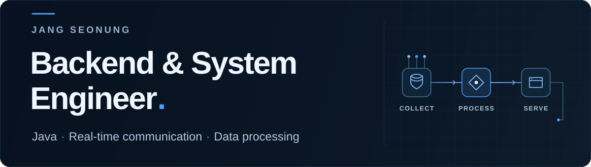

  

<a href="./README.md">English</a> &nbsp;·&nbsp; <a href="https://github.com/jang-sw">GitHub プロフィール</a>

## チャン・ソンウン / 張善雄

Java / Spring を中心に、Web サービスから装置向けソフトウェアまで携わってきたバックエンドエンジニアです。
サーバー API、WebSocket によるリアルタイム通信、C++ / Python による半導体装置データの収集・分析を経験しています。

既存システムの構造と課題の背景を理解し、保守しやすい設計と分かりやすいコミュニケーションを大切にしています。

`Java` &nbsp; `Spring` &nbsp; `C++` &nbsp; `Python` &nbsp; `SQL` &nbsp; `Linux`

## 個人プロジェクト・技術検証

以下は実務とは別に取り組んでいる公開プロジェクトです。開発中のものや学習用のデモも含みます。

### [AI Code Reviewer](https://github.com/jang-sw/AI-code-reviewer_dev-by-codex) — 開発中

Git の変更履歴を定期的にレビューし、レビューキューと内部課題管理を扱う Spring Boot アプリケーション。Codex を活用して開発しています。

**Java 25 / Spring Boot / PostgreSQL** · [構成・処理フロー](https://github.com/jang-sw/AI-code-reviewer_dev-by-codex/blob/main/PROJECT.md)

### [勤怠管理システム](https://github.com/jang-sw/Commuting-system-backend) — 個人プロジェクト

出退勤、休暇記録、管理者向けの検索機能を持つバックエンド。Vue のフロントエンドと組み合わせています。

**Spring Boot / JPA / QueryDSL** · [フロントエンド](https://github.com/jang-sw/Commuting-system-front)

### [Reactive Community API](https://github.com/jang-sw/Web3-multilingual-community-backend) — プロトタイプ

投稿、コメント、いいね、ページングを扱う WebFlux / R2DBC の API。Angular 側ではウォレット連携も試しています。

**Spring WebFlux / R2DBC / Angular** · [フロントエンド](https://github.com/jang-sw/Web3-multilingual-community-frontend)

### [WebSocket Messaging](https://github.com/jang-sw/Spring-reactor-netty-websocket-demo) — 技術検証デモ

WebSocket のセッション管理、JSON メッセージのルーティング、ブロードキャスト処理を学ぶためのデモ。

**Java / Spring WebFlux / Reactor Netty**

## 実務で大切にしていること

- **要件整理から運用保守まで。** API の設計・実装・テストに加え、既存機能の改善や性能調査にも取り組んでいます。
- **装置とデータをつなぐ開発。** Linux 環境で C++ のソケット通信と Python の収集・分析処理を担当しています。
- **日本語での技術コミュニケーション。** 日本のお客様との会議、仕様確認、設計書・報告書の作成、日程調整を経験しています。
- **チームでの課題解決。** 約 10 名のプロジェクトで 3 名チームをリードし、作業分担や進捗・課題の共有を担当しました。

**韓国語 / 日本語（JLPT N1）**

現在は、小さな [Spring Boot MSA の学習用構成](https://github.com/jang-sw/msa-demo)を通じてサービスの分割を学びながら、AI レビューツールの開発にも取り組んでいます。

---

課題を理解し、設計を明確にし、保守を見据えてつくる。

