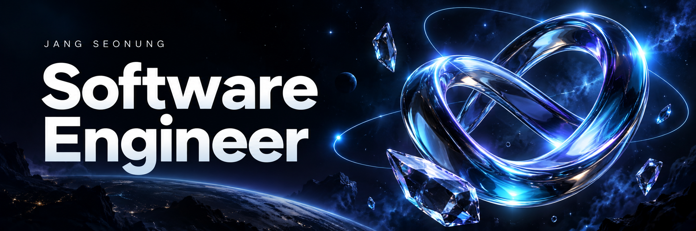

  

  <b>장선웅 &nbsp;·&nbsp; Jang Seonung &nbsp;·&nbsp; チャン・ソンウン</b>

  

  I build web applications and software, and enjoy exploring different technologies. 
  I like understanding how things work and turning ideas into something useful.

  <a href="./README.ja.md">日本語</a> &nbsp; / &nbsp;
  <a href="https://github.com/jang-sw?tab=repositories">Explore my repositories ↗</a>

  

  Korean &nbsp;·&nbsp; Japanese &nbsp;·&nbsp; JLPT N1

